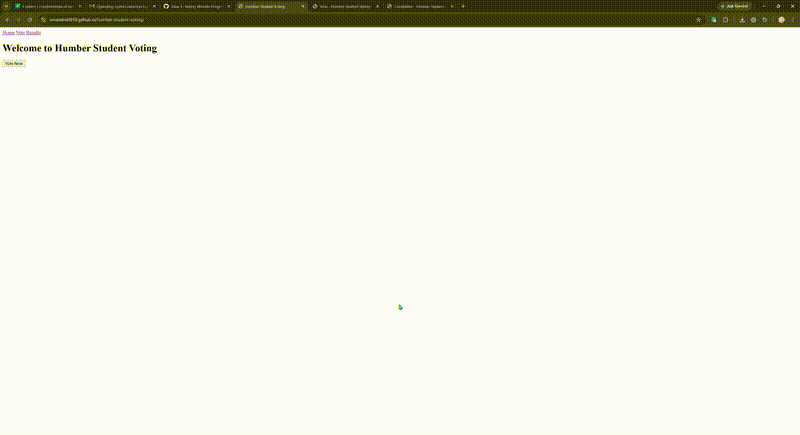

# Humber Student Voting

A web application that lets Humber students vote for their student union representatives, inspired by the IGNITE elections. Built to make voting more convenient, accessible, and transparent.

## Feature Demo

The demo above shows:
- The homepage with navigation and "Vote Now" button
- Casting a vote for a candidate on the voting page
- Viewing the candidate profiles page

## Features Implemented (Phase 2)

- **Homepage** — welcome message, navigation menu, "Vote Now" button
- **Voting Form** — displays a list of candidates, allows voting, shows a confirmation message, and tracks vote counts using JavaScript
- **Candidate Profile Section** — displays each candidate's name, photo, and bio

## Technologies

- HTML, CSS, JavaScript
- GitHub Pages for deployment

## Live Site

https://omarelmi0010.github.io/humber-student-voting/

## Project Status

This project is being developed individually, as noted in the project plan, due to being unable to reach other team members. Current focus is on live results display (Chart.js integration) for the next phase.